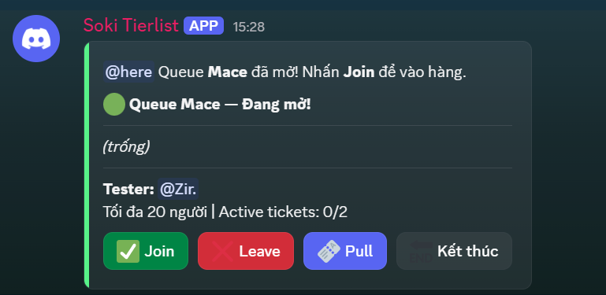
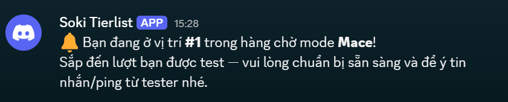
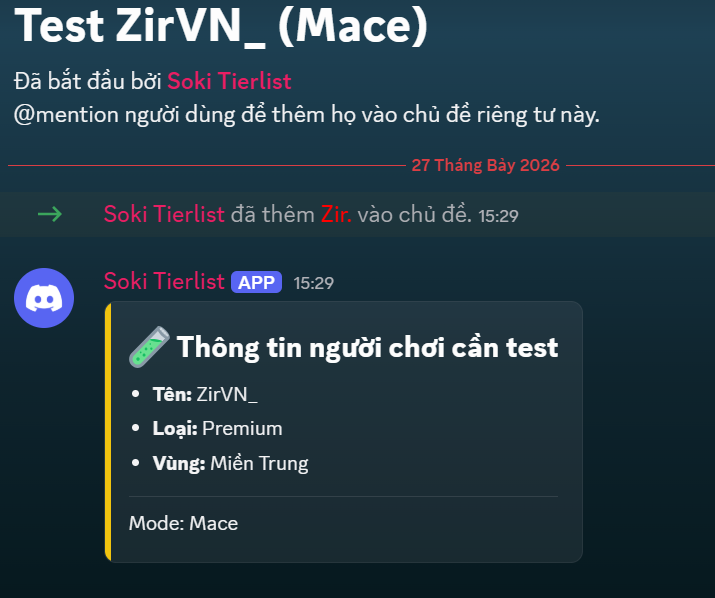
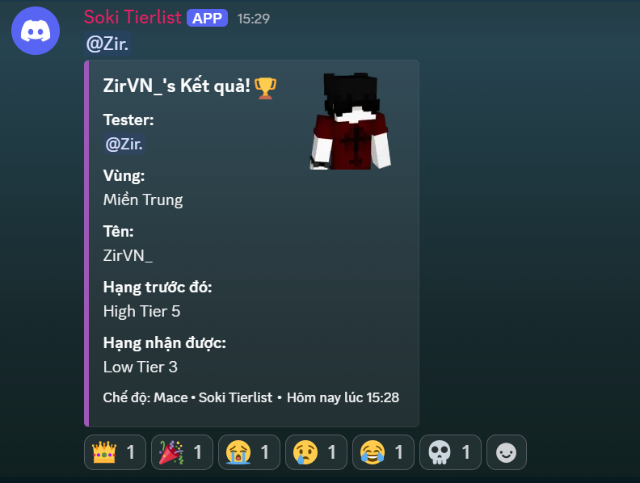
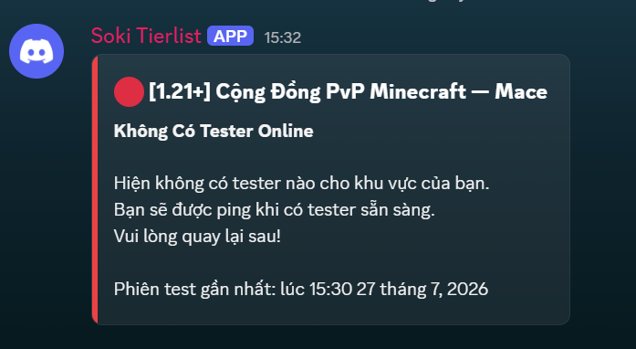

# Soki Tierlist 🏆

Soki Tierlist là một bot Discord dành riêng cho việc quản lý hàng chờ (queue), xác thực tài khoản, và tự động xếp hạng (tier) người chơi Minecraft (đặc biệt là cho các chế độ PvP).

## Tính Năng Chính ✨
- **Xác Thực (Verify)**: Người chơi có thể xác thực tài khoản game (Premium/Crack) và khu vực.
- **Hàng Chờ (Queue)**: Quản lý hàng chờ cho nhiều mode khác nhau (Crystal, Sword, Mace, v.v.). Hỗ trợ thông báo qua tin nhắn riêng (DM) khi tới lượt.
- **Tự Động Cấp Quyền**: Tự động gán/thu hồi các role tương ứng (waitlist role, tier role) sau khi kết thúc buổi test.
- **Cooldown**: Hệ thống cooldown chống spam, áp dụng riêng biệt cho từng mode.

## Showcase 📸

Dưới đây là một số hình ảnh về bot trong quá trình hoạt động:







## Cài Đặt (Setup) 🛠️

1. **Clone dự án** và mở terminal ở thư mục dự án.
2. **Cài đặt các gói phụ thuộc** (dependencies):
   ```bash
   npm install
   ```
3. **Cấu hình biến môi trường**:
   - Sao chép file `.env.example` (nếu có) hoặc tạo một file `.env` ở thư mục gốc.
   - Điền đầy đủ thông tin:
     ```env
     BOT_TOKEN=your_bot_token_here
     CLIENT_ID=your_bot_client_id
     GUILD_ID=your_test_server_id # Để trống nếu muốn đăng ký lệnh Global
     VERIFY_ROLE_ID=
     RESULTS_CHANNEL_ID=
     WELCOME_CHANNEL_ID=
     COOLDOWN_HOURS=120
     # Cấu hình Role cho từng mode và hạng
     ```
4. **Khởi chạy bot**:
   ```bash
   npm start
   ```

## Cấu Trúc Mã Nguồn 📂
- `index.js`: Điểm bắt đầu (entry point) của bot. Khởi tạo client và đăng ký (register) các Slash Commands.
- `database.js`: Xử lý giao tiếp với SQLite database (lưu trữ người dùng đã xác thực, lịch sử và tier).
- `config.js`: Tải và parse biến môi trường từ `.env` để lấy thiết lập cho từng Mode và Tier.
- `ft/`: Chứa các tính năng (features) cụ thể:
  - `verify.js`: Giao diện và logic xác thực người dùng.
  - `queue.js`: Cho phép người chơi tham gia vào hàng chờ.
  - `tester.js`: Quản lý hệ thống hàng chờ (dành cho Admin và Tester).
  - `welcome.js`: Gửi tin nhắn tự động chào mừng thành viên mới.

## Tác Giả 🖋️
Được phát triển bởi **ZirVN**.
